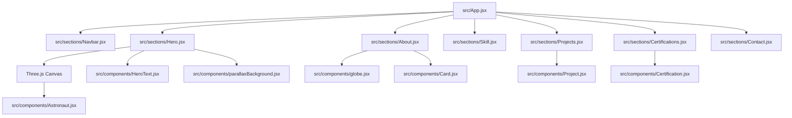

# Gaurav Ghude — Creative Portfolio

Welcome to my personal portfolio repository! This is a state-of-the-art, interactive 3D portfolio website showcasing my engineering projects, design expertise, certifications, and technical skillset. 

**Live Link**: [portfolio-orcin-chi-92.vercel.app](https://portfolio-orcin-chi-92.vercel.app/)

---

## Tech Stack & Architecture

This application is built with modern frontend tools focused on performance, modularity, and high-fidelity visual aesthetics:

* **Core Framework**: React 19 + Vite (for ultra-fast development and build cycles)
* **3D Visuals & Engine**: React Three Fiber (R3F) + Three.js + `@react-three/drei`
* **Animations**: Motion (Framer Motion v12) + GSAP
* **Styling**: Tailwind CSS v4 (responsive utility classes & custom theme variables)
* **Backend Services**: EmailJS (serverless contact form handling)

---

## Key Animated Content & Features

* **3D Hero Integration**: Renders a custom 3D model in the hero section using a dynamic `<primitive>` loading component to ensure file-safety.
* **Interactive Camera Rigging**: The 3D scene camera dynamically tracks the user's cursor movements for a subtle, engaging depth effect.
* **Typographic Loop**: Includes a fluid `FlipWords` component powered by Framer Motion that cycles through core professional titles.
* **Multi-Layer Parallax Background**: An overlay sky, planet, and mountain scene that slides dynamically relative to user page-scrolls.
* **Interactive Skill Cards**: Grid-aligned components featuring smooth micro-animations, hover translation vectors, and custom styling filters.
* **Drag-Interaction Globe**: A lightweight, interactive 3D canvas-rendered earth globe showcasing global landmarks.

---

## Code & Architecture Flow

The project's file structure is modular, dividing content into sections and reusable visual blocks:

1. **Initialisation (`main.jsx` & `App.jsx`)**: The React entry point bootstraps global styles (`index.css` Tailwind imports) and stitches the modular sections together.
2. **Dynamic Configuration (`constants/index.js`)**: All portfolio content (project details, credentials, timeline logs, and social URLs) is stored as modular objects, making content modifications code-free.
3. **Modal Previews**: Clicking *Read More* on project or certificate rows calls a details portal overlay, providing detailed highlights and screenshots without redirecting the user.
4. **Serverless Mail Dispatcher**: Submit actions trigger EmailJS which validates parameter payloads and securely forwards messages straight to Google's Mail API.

